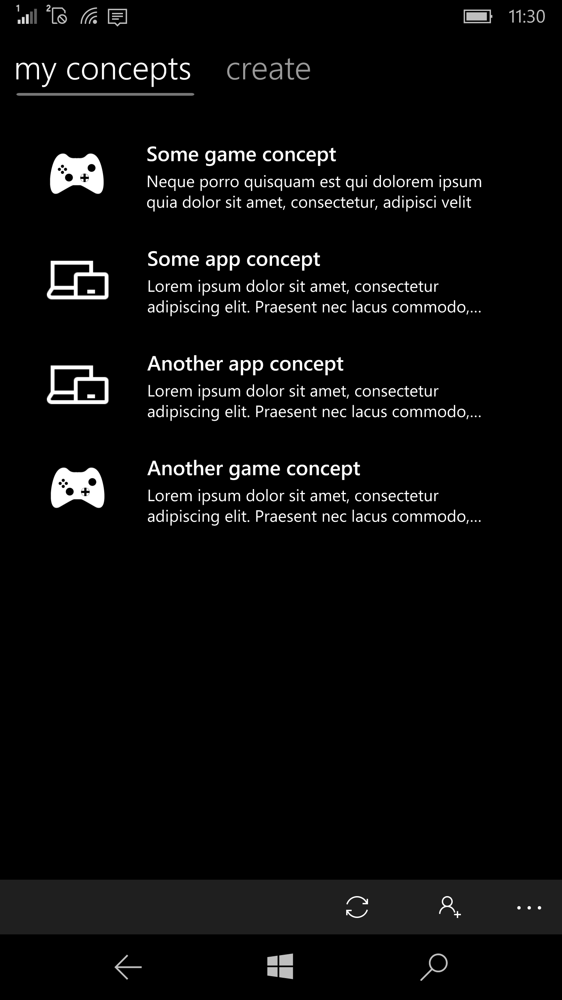
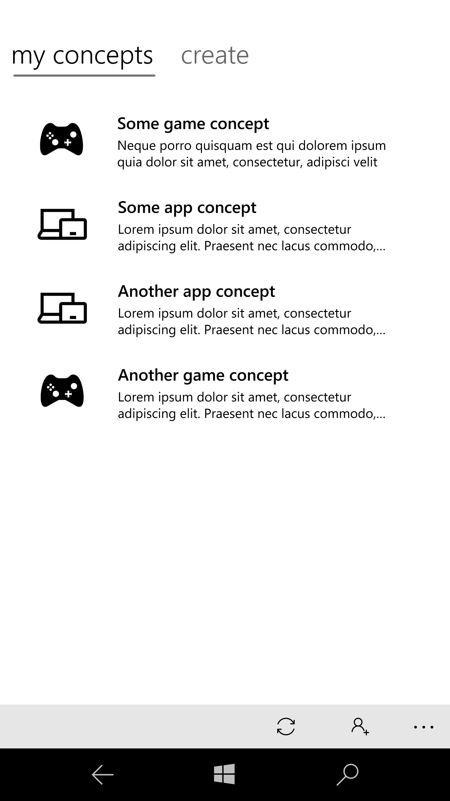
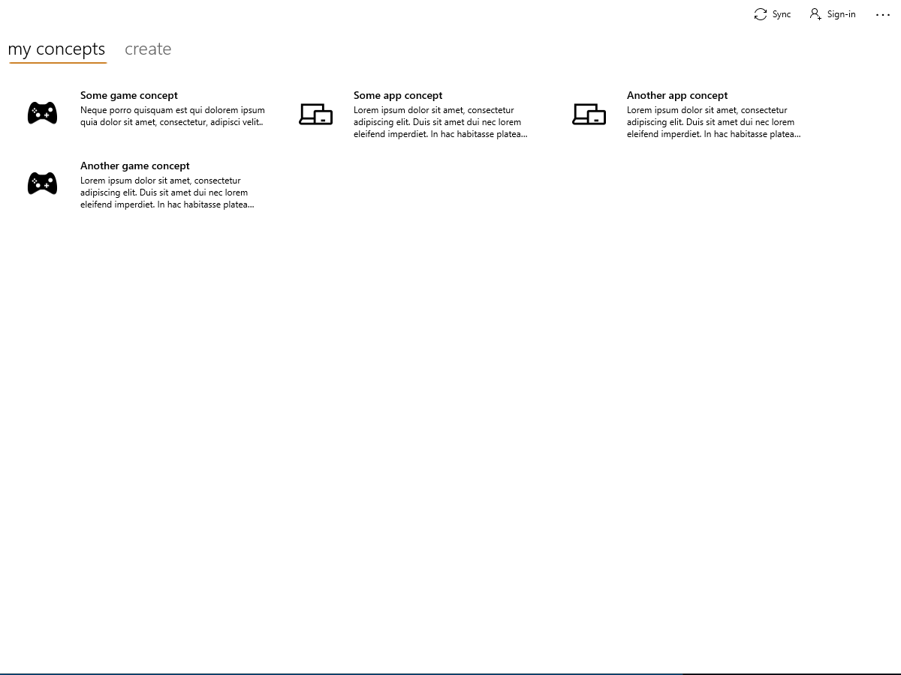
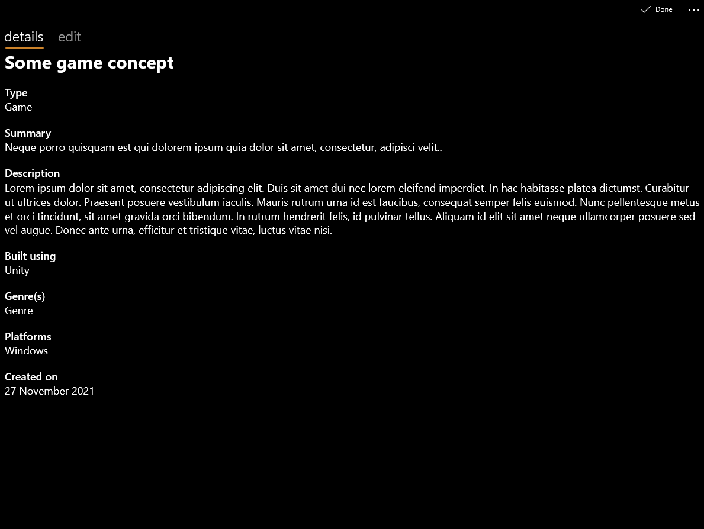

<h2>Concept Pad</h2>

Concept Pad is a simple application that helps you jot down game concepts and ap ideas instantly. Using a text editor for those can get messy, and that's where this app comes in. The app lets you quickly create concepts, edit them, delete them and even share them with other people. Your concepts will sync between devices signed with the same Microsoft account.

The app is available to download for Windows 10, Windows 10 Mobile and Windows 11. 

## Description
This app is built using the Universal Windows Platform framework using C# and XAML. The control use WinUI 2. The app implements the MVVM design pattern. The concepts created are stored in JSON format in a txt file locally and on the user's OneDrive. A Singleton is used for managing the collection of concepts and reading/writing to the save file. OneDrive storage is implemented using Microsoft Graph.

## Screenshots
<table><tr>
<td>  </td>
<td>  </td>
<td>  </td>
<td>  </td>
</tr></table>

## Building
The app requires Visual Studio 2017 and above to be built. You will need the Universal Windows Platform compnent installed. With all of that installed, just clone the repo and run the .sln file. 

## Contributing and more
PRs are welcome! Make sure you create a new branch when making changes and pushing them. 
Please report any bugs in the Issues section. Include your OS, app version, a detailed description and steps to reproduce in the bug report.

## License 
This project is licensed under the GNU General Public License 3. Check LICENSE for more information.
